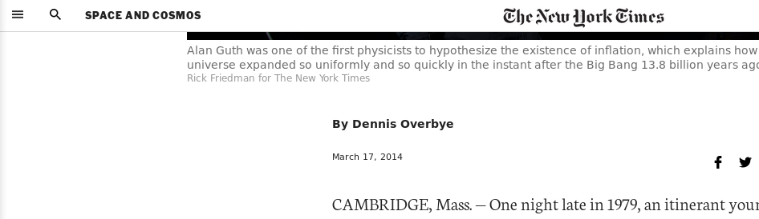
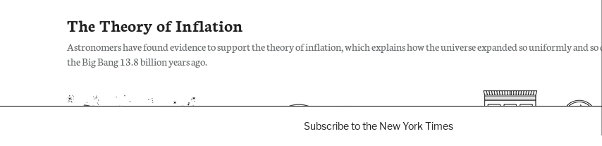
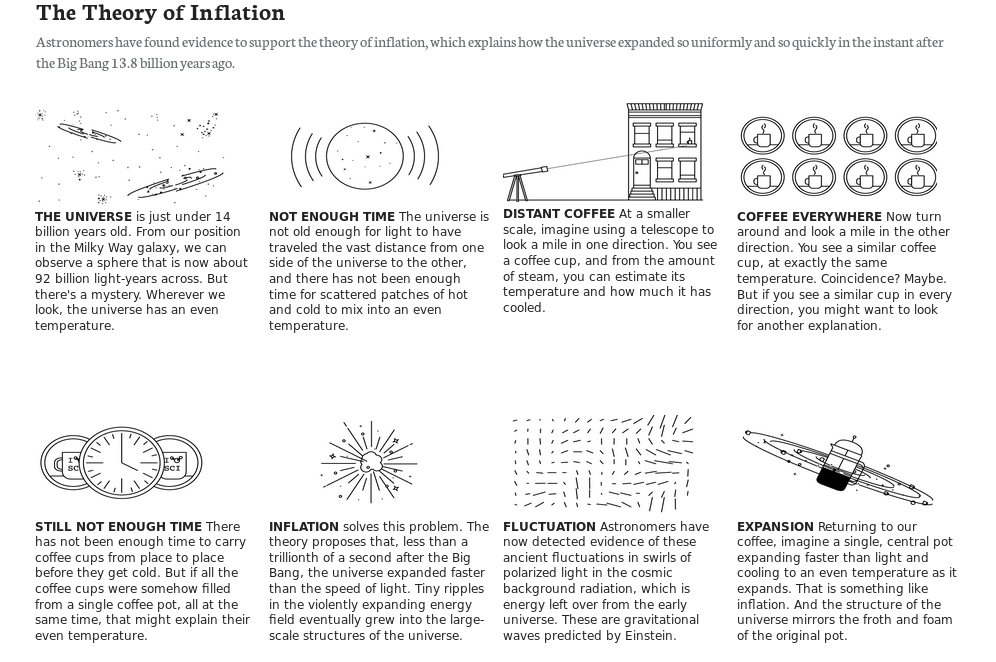

# Positioning-and-Floating-Elements

Microverse Collaborative Project. This assignment consists of making a clone of [this New York Times article page](https://www.nytimes.com/2014/03/18/science/space/detection-of-waves-in-space-buttresses-landmark-theory-of-big-bang.html).

# Features

* Floating fixed navbar

* Floating fixed overlay on the bottom

* Floating aside

* Grids without `flex` or `grid`

# Built With

* Love and Passion for code.
* HTML5 with help of SASS Compiler.

# Authors

* [Mario Dena](https://github.com/MarioDena).
* [Israel Laguan](https://github.com/Israel-Laguan)

# Mentions

The images are from the original site.

 

  
Icons:

  <ul>
    <li>Some icons by Google, Dave Gandy, Yannick, GraphicsBay from www.flaticon.com </li>
  </ul>
  
 Each asset belog to each author(s).

# License

This project is licensed under the MIT License - see the [LICENSE.md](LICENSE.md) file for details
